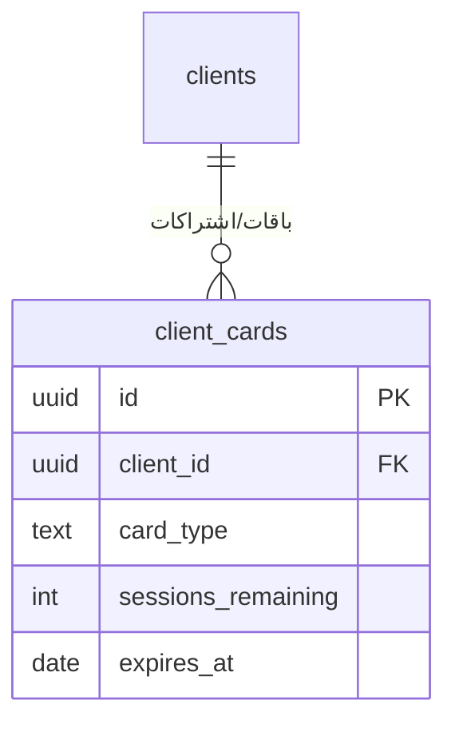

# DATABASE_DIAGRAM.md
## مخطط علاقات قاعدة البيانات — نظام Beauty

> هاد المخطط مكتوب بصيغة **Mermaid** — لغة نص بسيطة بتتحول لرسمة تلقائيًا. لو حطيت هاد الملف بـGitHub (بامتداد `.md`)، GitHub بيعرضه كرسمة تلقائيًا. تقدر كمان تلصق الكود بموقع **mermaid.live** لمعاينته مباشرة.

---

## 1. الجداول الفعلية الموجودة حاليًا (مؤكّدة ومبنية)

```mermaid
erDiagram
    salons ||--o{ profiles : "كل صالون له مستخدمين"
    salons ||--o{ clients : "كل صالون له زبائن"
    profiles ||--o{ audit_log : "كل حركة تدقيق مرتبطة بمستخدم"
    clients ||--o{ audit_log : "كل حركة تدقيق مرتبطة بزبون"
    clients ||--o{ client_relationships : "علاقات الزبون (ثنائية الاتجاه)"
    clients ||--o{ client_ledger : "سجل حركات الرصيد"
    clients ||--o{ client_files : "ملفات مرفقة + صورة شخصية"
    salons ||--o{ acquisition_sources : "قائمة مصادر خاصة بكل صالون"
    salons ||--o{ categories : "قائمة فئات خاصة بكل صالون"
    acquisition_sources ||--o{ clients : "مصدر اكتساب الزبون (اختياري)"
    categories ||--o{ clients : "فئة الزبون (اختياري، Single-select)"
    salons ||--o{ business_hours : "ساعات عمل أسبوعية (7 صفوف لكل صالون)"
    salons ||--o{ salon_business_types : "أنواع النشاط المختارة (Many-to-many)"
    salons ||--o{ service_categories : "فئات الخدمات (شجرة تشاور على نفسها)"
    service_categories ||--o{ service_categories : "فئة رئيسية ← فئات فرعية (parent_id)"
    service_categories ||--o{ services : "خدمات الفئة"
    salons ||--o{ employees : "موظفو الصالون (مستقلين عن profiles)"
    profiles ||--o| employees : "حساب دخول اختياري لموظف (profile_id، SET NULL)"
    employees ||--o| employee_schedules : "دوام واحد لكل موظف حاليًا"
    employee_schedules ||--o{ employee_schedule_slots : "فترات/أيام الدوام الفعلية"
    services ||--o{ service_role_prices : "استثناءات سعر حسب الدور (اختياري)"
    clients ||--o{ appointments : "حجوزات الزبون"
    services ||--o{ appointments : "الخدمة المحجوزة"
    employees ||--o{ appointments : "الموظف المنفّذ (اختياري لقائمة الانتظار)"
    salons ||--o{ resources : "موارد الصالون (غرفة/جهاز بسعة)"
    resources ||--o{ resource_units : "وحدات داخلية (مخفية عن المستخدم)"
    services }o--o{ resources : "ربط many-to-many عبر service_resources"
    resource_units ||--o{ appointments : "الوحدة المخصّصة للحجز (اختياري)"
    salons ||--o{ cancellation_reasons : "أسباب إلغاء خاصة بكل صالون"
    cancellation_reasons ||--o{ appointments : "سبب الإلغاء (إجباري إذا cancelled)"
    reschedule_reasons ||--o{ appointments : "سبب إعادة الجدولة (إجباري إذا rescheduled)"
    adjustment_reasons ||--o{ appointments : "سبب تعديل المدة (إجباري إذا adjusted)"
    appointments ||--o| appointments : "سلسلة إعادة الجدولة/التعديل (superseded_by_id، اتجاه واحد، مشترك بين rescheduled وadjusted) + تجميع المشاركين (group_id، self-reference للأساسي)"
    employees ||--o{ employee_schedule_exceptions : "استثناءات دوام ليوم محدد"
    appointments ||--o| employee_schedule_exceptions : "الحجز مصدر الاستثناء (تنظيف تلقائي)"

    salons {
        uuid id PK
        text name
        timestamptz created_at
    }

    profiles {
        uuid id PK "نفس معرف المستخدم بـ Supabase Auth"
        uuid salon_id FK
        text email
        timestamptz created_at
    }

    clients {
        uuid id PK
        uuid salon_id FK
        text first_name
        text last_name
        text phone_number "فريد لكل صالون"
        text email
        text gender
        text category
        date birthday
        text facebook "حساب/رابط فيسبوك للتواصل المباشر"
        text instagram "حساب انستقرام للتواصل المباشر"
        text whatsapp_number "بدّلناه من viber_number — رقم واتساب للتواصل المباشر"
        text acquisition_source "من وين سمع فينا الزبون (تسويقي)"
        text utm_campaign
        text utm_source
        text utm_medium
        text card_number
        numeric max_debt_limit
        text preferred_professional
        text company_name
        text position_title
        text address_city
        text address_street
        boolean registration_address_differs
        text passport_number
        text identification_code
        text client_status "potential/active/inactive/blacklisted — الوضع الحالي؛ إعادة تصميم كاملة مؤجّلة بوعي لما بعد موديول الحجوزات (تفصيل كامل بقسم 3.6 من PROJECT_HANDOFF.md)"
        text photo_path "مسار صورة شخصية بـ Storage bucket client-photos"
        uuid acquisition_source_id FK "جديد — يحل محل acquisition_source النصي تدريجيًا"
        uuid category_id FK "جديد — يحل محل category النصي تدريجيًا، Single-select"
        timestamptz created_at
        timestamptz archived_at "أرشفة بدل حذف نهائي"
    }

    audit_log {
        uuid id PK
        text table_name
        uuid record_id
        text action "insert/update/delete"
        jsonb old_data
        jsonb new_data
        uuid changed_by FK
        uuid salon_id
        timestamptz created_at
    }

    client_relationships {
        uuid id PK
        uuid client_id FK
        uuid related_client_id FK
        text relationship_type "spouse/child/friend... — الاتجاه المعاكس محسوب تلقائيًا بالكود، مش عمود مكرر"
    }

    client_ledger {
        uuid id PK
        uuid client_id FK
        text entry_type "credit_added/credit_removed"
        numeric amount
        text note
        uuid performed_by FK
        timestamptz created_at
    }

    client_files {
        uuid id PK
        uuid client_id FK
        text file_url
        text file_name
        timestamptz uploaded_at
    }

    acquisition_sources {
        uuid id PK
        uuid salon_id FK "معزول لكل صالون (RLS)"
        text name
        timestamptz created_at
    }

    categories {
        uuid id PK
        uuid salon_id FK "معزول لكل صالون (RLS)"
        text name "VIP, Black list, Family/friends... + قيم مخصّصة يضيفها كل صالون"
        timestamptz created_at
    }

    business_hours {
        uuid id PK
        uuid salon_id FK "معزول لكل صالون (RLS)"
        smallint day_of_week "0-6، اصطلاح JS Date.getDay() — 0=الأحد"
        boolean is_open
        time open_time
        time close_time
        timestamptz created_at
        "unique (salon_id, day_of_week)"
    }

    salon_business_types {
        uuid id PK
        uuid salon_id FK "معزول لكل صالون (RLS)"
        business_type business_type "ENUM: hairdressing/barbershop/cosmetology/nails/makeup/massage/tanning — مفاتيح إنجليزية، الترجمة بملف settings.json"
        timestamptz created_at
        "unique (salon_id, business_type)"
    }

    service_categories {
        uuid id PK
        uuid salon_id FK "معزول لكل صالون (RLS)"
        uuid parent_id FK "فاضي = فئة رئيسية، معبّى = فئة فرعية (self-referencing)"
        business_type business_type "إلزامي لو فئة رئيسية، ممنوع لو فرعية (CHECK constraint)"
        employee_role pricing_role "اختياري — عمود الفئة بمصفوفة تحديد الأسعار. فاضي = يرث من الفئة الأم؛ فاضي بكل السلسلة = مستثنى من المصفوفة (tanning)"
        text name
        integer sort_order
        timestamptz created_at
        "FK مركّب (parent_id, salon_id) → يمنع فئة تتبع صالون تاني + ON DELETE RESTRICT"
    }

    services {
        uuid id PK
        uuid salon_id FK "معزول لكل صالون (RLS)"
        uuid category_id FK "FK مركّب (category_id, salon_id)، ON DELETE RESTRICT"
        text name
        integer duration_minutes "CHECK > 0"
        numeric price "CHECK >= 0"
        text color "صيغة #RRGGBB، موروث من الفئة الرئيسية"
        service_sex sex "ENUM: all/men/women — افتراضي all"
        boolean is_active
        integer sort_order
        timestamptz created_at
        "unique(id, salon_id) — أُضيف بالمرحلة 3.ب لدعم ربط service_role_prices"
    }

    employees {
        uuid id PK
        uuid salon_id FK "معزول لكل صالون (RLS)"
        text name
        employee_role role "ENUM: 10 أدوار (cosmetologist, hairdresser, makeup_artist, manicure_professional, masseur, pedicure_professional, stylist, administrator, executive, owner)"
        uuid profile_id FK "اختياري — حساب دخول لو وجد، ON DELETE SET NULL، unique (حساب واحد = موظف واحد بالأكثر)"
        boolean is_assistant "يحكم ظهور العمود بالتقويم افتراضيًا فقط (زر 'عرض المساعدين') — لا يؤثر على role ولا على الأهلية للاختيار كموظف إضافي"
        timestamptz created_at
    }

    employee_schedules {
        uuid id PK
        uuid salon_id FK "معزول لكل صالون (RLS)"
        uuid employee_id FK "FK مركّب (employee_id, salon_id)، ON DELETE CASCADE، unique (صف واحد لكل موظف حاليًا)"
        employee_schedule_pattern pattern_type "ENUM: weekly / even_odd / cycle"
        date starts_on "إجباري لـ even_odd/cycle، اختياري لـ weekly (CHECK)"
        smallint work_days_count "إجباري لـ cycle بس، ممنوع لغيره (CHECK)"
        smallint cycle_length_days "إجباري لـ cycle بس، ممنوع لغيره (CHECK)"
        timestamptz created_at
    }

    employee_schedule_slots {
        uuid id PK
        uuid salon_id FK "معزول لكل صالون (RLS)"
        uuid schedule_id FK "FK مركّب (schedule_id, salon_id)، ON DELETE CASCADE"
        text slot_key "معنى متغيّر حسب النمط: '0'-'6' لـweekly، 'even'/'odd'، أو 'work' لـcycle"
        boolean is_active
        time start_time
        time end_time "CHECK end_time > start_time"
        timestamptz created_at
        "unique(schedule_id, slot_key)"
    }

    service_role_prices {
        uuid id PK
        uuid salon_id FK "معزول لكل صالون (RLS)"
        uuid service_id FK "FK مركّب (service_id, salon_id)، ON DELETE CASCADE"
        employee_role role
        numeric price "CHECK >= 0"
        timestamptz created_at
        "unique(service_id, role) — جدول استثناءات فقط، غياب الصف = يُعتمد services.price الأساسي"
    }

    role_business_types {
        uuid id PK
        employee_role role
        business_type business_type
        timestamptz created_at
        "بدون salon_id — قاعدة نظام عامة، قراءة فقط من التطبيق (صفر سياسات كتابة)"
        "unique(role, business_type) — many-to-many، مزروع يدويًا فقط عبر SQL Editor"
    }

    appointments {
        uuid id PK
        uuid salon_id FK "معزول لكل صالون (RLS)"
        uuid client_id FK "FK مركّب، ON DELETE RESTRICT — الحجز سجل تاريخي حقيقي"
        uuid service_id FK "FK مركّب، ON DELETE RESTRICT"
        uuid employee_id FK "FK مركّب، ON DELETE RESTRICT، nullable لحالة waiting"
        uuid resource_unit_id FK "FK مركّب، ON DELETE RESTRICT، nullable — خدمة بدون مورد ما بتحجز وحدة"
        uuid cancellation_reason_id FK "FK مركّب، ON DELETE RESTRICT، إجباري إذا cancelled وممنوع لغيرها (CHECK)"
        uuid reschedule_reason_id FK "FK مركّب، ON DELETE RESTRICT، إجباري إذا rescheduled وممنوع لغيرها"
        uuid adjustment_reason_id FK "FK مركّب، ON DELETE RESTRICT، إجباري إذا adjusted وممنوع لغيرها"
        uuid superseded_by_id FK "FK مركّب DEFERRABLE INITIALLY DEFERRED، ON DELETE RESTRICT، unique — مشترك بين rescheduled وadjusted (أُعيدت تسميته من rescheduled_to_id)، إجباري لكليهما وممنوع لغيرهما (CHECK)، وCHECK يمنع الإشارة الذاتية"
        uuid group_id FK "FK مركّب، بدون DEFERRABLE — يساوي id نفسه للصف الأساسي (self-reference)، فيوجد فورًا بلا تبعية دائرية"
        boolean is_primary "CHECK (is_primary = (group_id = id))؛ unique(group_id) WHERE is_primary — أساسي واحد بالضبط لكل مجموعة"
        timestamptz start_time "nullable لحالة waiting فقط"
        timestamptz end_time "CHECK end_time > start_time"
        appointment_status status "ENUM: waiting/booked/pending_approval/completed/cancelled/no_show/rescheduled/adjusted"
        text note
        timestamptz cancelled_at "إجباري إذا cancelled وممنوع لغيرها (CHECK)"
        timestamptz created_at
        "EXCLUDE constraint (employee_id, tstzrange) — يشمل booked/completed/pending_approval، يستثني cancelled/no_show/rescheduled/adjusted"
        "EXCLUDE constraint ثانٍ (resource_unit_id, tstzrange) — نفس المنطق على مستوى وحدة المورد"
        "CHECK ثنائي الاتجاه: cancelled ⇔ (cancellation_reason_id + cancelled_at) معًا، لا أحدهما بدون الآخر"
    }

    cancellation_reasons {
        uuid id PK
        uuid salon_id FK "معزول لكل صالون (RLS)"
        text name
        boolean is_active "مخرج RESTRICT — سبب مستخدم يُعطَّل لا يُحذف"
        integer sort_order
        timestamptz created_at
        "unique(id, salon_id) + unique(salon_id, name)"
    }

    reschedule_reasons {
        uuid id PK
        uuid salon_id FK "معزول لكل صالون (RLS)"
        text name
        boolean is_active "مخرج RESTRICT — نفس نمط cancellation_reasons حرفيًا"
        integer sort_order
        timestamptz created_at
        "unique(id, salon_id) + unique(salon_id, name) — جدول منفصل عمدًا عن cancellation_reasons (أسباب مختلفة المعنى)"
    }

    adjustment_reasons {
        uuid id PK
        uuid salon_id FK "معزول لكل صالون (RLS)"
        text name
        boolean is_active "مخرج RESTRICT"
        integer sort_order
        timestamptz created_at
        "unique(id, salon_id) + unique(salon_id, name) — الجدول الثالث بنفس الشكل (بعد cancellation_reasons وreschedule_reasons)، توحيدها مؤجَّل بوعي"
    }

    employee_schedule_exceptions {
        uuid id PK
        uuid salon_id FK "معزول لكل صالون (RLS)"
        uuid employee_id FK "FK مركّب، ON DELETE CASCADE"
        date exception_date "استثناء ليوم واحد بالذات فقط، لا يمس نمط الدوام المتكرر"
        time start_time
        time end_time "CHECK end_time > start_time"
        uuid appointment_id FK "الحجز الذي وُلد منه الاستثناء، unique، ON DELETE CASCADE — يُمكّن التنظيف التلقائي عند الإلغاء/إعادة الجدولة"
        timestamptz created_at
        "صفوف متعددة ممكنة لنفس اليوم (اتحاد نوافذ منفصلة، لا توسيع نافذة واحدة)"
    }

    resources {
        uuid id PK
        uuid salon_id FK "معزول لكل صالون (RLS)"
        text name
        smallint capacity "CHECK > 0 — عدد الزبائن الذين يخدمهم المورد بنفس الوقت"
        integer sort_order "ترتيب تعبئة متسلسل — المورد الأول يمتلئ كاملًا قبل التالي"
        timestamptz created_at
    }

    resource_units {
        uuid id PK
        uuid salon_id FK "معزول لكل صالون (RLS)"
        uuid resource_id FK "FK مركّب، ON DELETE CASCADE — الوحدة بلا معنى بدون موردها"
        smallint unit_index "1..capacity — مُزامَن تلقائيًا بـTrigger عند تغيير السعة"
        timestamptz created_at
        "وحدات مخفية عن المستخدم تمامًا — تفصيل تنفيذي داخلي فقط"
    }

    service_resources {
        uuid id PK
        uuid salon_id FK "معزول لكل صالون (RLS)"
        uuid service_id FK "FK مركّب، ON DELETE CASCADE"
        uuid resource_id FK "FK مركّب، ON DELETE CASCADE"
        timestamptz created_at
        "unique(service_id, resource_id) — many-to-many، بدائل لا متطلبات متزامنة"
    }
```

**ملاحظة على `employees`, `employee_schedules`, `employee_schedule_slots`, `service_role_prices`:** جداول المرحلة 3 من موديول دفتر المواعيد (تفصيل كامل بقسم 3.7 من `PROJECT_HANDOFF.md`). **قرار معماري جوهري:** `employees` مستقل تمامًا عن `profiles` — موظف ممكن يوجد بلا حساب دخول إطلاقًا (لأخصائية مثلًا ما بتحتاج تدخل عالنظام).

**ملاحظة على `business_hours`, `salon_business_types`, `service_categories`, `services`:** الجداول الأربعة هاي جزء من **موديول دفتر المواعيد** (تفصيل كامل بقسم 3.7 من `PROJECT_HANDOFF.md`). كلهم عندهم Trigger تلقائي يزرع قيم افتراضية (ساعات عمل 9-6، كتالوج خدمات كامل) لأي صالون جديد ينخلق، بغض النظر عن طريقة الإنشاء — لأنه ما في مسار إنشاء صالون بالتطبيق نفسه لسا (كل الصالونات تُنشأ يدويًا بـSupabase).

**ملاحظة على `photo_path`:** هاد عمود إضافي بجدول `clients` نفسه (مش جدول منفصل) — بيخزّن مسار الصورة الشخصية الوحيدة للزبون بـbucket `client-photos` تحت مسار `avatars/{client_id}/...`. مختلف عن `client_files` يلي بيخزّن ملفات عامة متعددة (عقود، مستندات) تحت مسار `files/{client_id}/...` بنفس الـbucket.

**ملاحظة على حقول التواصل مقابل حقول التسويق (فرق مهم، اتوضّح لاحقًا بالمحادثة):**
- `facebook`, `instagram`, `whatsapp_number` = قنوات **تواصل مباشر** مع الزبون نفسه (تراسله عبرها مباشرة).
- `acquisition_source`, `utm_source`, `utm_medium`, `utm_campaign` = بيانات **تسويقية تحليلية** (من وين سمع فينا، لقياس فعالية الحملات) — لا علاقة لها بالتواصل المباشر.

---

## 2. الإضافات المخطَّطة (قيد البناء حاليًا أو قادمة)



*(`client_relationships`, `client_ledger`, `client_files`, `acquisition_sources`, `categories` انتقلوا للقسم 1 فوق — مبنيين ومؤكّدين فعليًا بقاعدة البيانات الحقيقية. تصميم `categories` النهائي صار **Single-select مباشر** عبر `clients.category_id`، لا جدول وسيط `client_categories` — قرار واعٍ لتفادي Over-engineering، راجع قسم 3.3 من `PROJECT_HANDOFF.md`.)*

---

## 3. ملاحظة مهمة

الجزء الأول (القسم 1) هو **الوضع الفعلي المؤكّد بقاعدة البيانات الحقيقية حاليًا** — يشمل هلق `client_relationships`، `client_ledger`، و`client_files` (تأكّد وجودهم شخصيًا من Table Editor بـSupabase، ومُختبرين فعليًا بالمتصفح: رصيد، أقارب، رفع ملفات). الجزء الثاني (القسم 2) هو **تصميم مخطَّط لإضافات لسا ما بنيناها** (Multi-category، باقات/Cards).

**حدّث هاد الملف بعد كل إضافة جدول جديد فعلية** — انقل الجدول من القسم 2 (مخطَّط) للقسم 1 (فعلي) بمجرد ما يُبنى ويُختبر.
