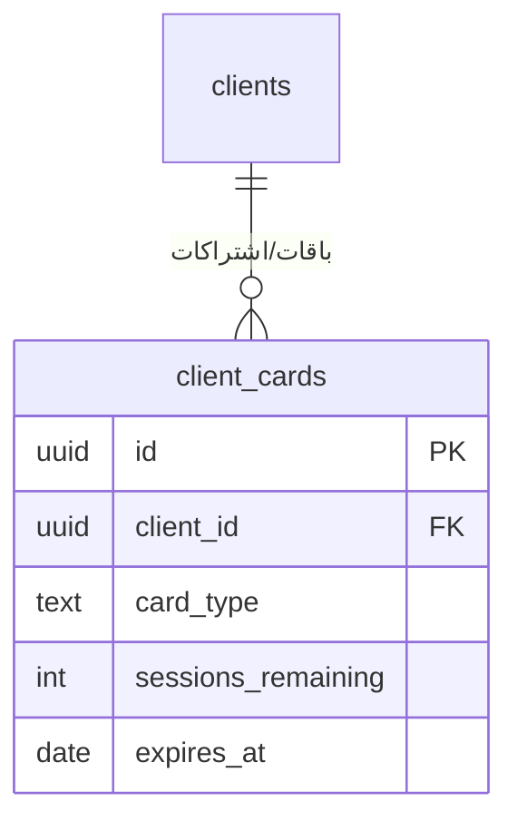

# DATABASE_DIAGRAM.md
## مخطط علاقات قاعدة البيانات — نظام Beauty

> هاد المخطط مكتوب بصيغة **Mermaid** — لغة نص بسيطة بتتحول لرسمة تلقائيًا. لو حطيت هاد الملف بـGitHub (بامتداد `.md`)، GitHub بيعرضه كرسمة تلقائيًا. تقدر كمان تلصق الكود بموقع **mermaid.live** لمعاينته مباشرة.

---

## 1. الجداول الفعلية الموجودة حاليًا (مؤكّدة ومبنية)

```mermaid
erDiagram
    salons ||--o{ profiles : "كل صالون له مستخدمين"
    salons ||--o{ clients : "كل صالون له زبائن"
    profiles ||--o{ audit_log : "كل حركة تدقيق مرتبطة بمستخدم"
    clients ||--o{ audit_log : "كل حركة تدقيق مرتبطة بزبون"
    clients ||--o{ client_relationships : "علاقات الزبون (ثنائية الاتجاه)"
    clients ||--o{ client_ledger : "سجل حركات الرصيد"
    clients ||--o{ client_files : "ملفات مرفقة + صورة شخصية"
    salons ||--o{ acquisition_sources : "قائمة مصادر خاصة بكل صالون"
    salons ||--o{ categories : "قائمة فئات خاصة بكل صالون"
    acquisition_sources ||--o{ clients : "مصدر اكتساب الزبون (اختياري)"
    categories ||--o{ clients : "فئة الزبون (اختياري، Single-select)"
    salons ||--o{ business_hours : "ساعات عمل أسبوعية (7 صفوف لكل صالون)"
    salons ||--o{ salon_business_types : "أنواع النشاط المختارة (Many-to-many)"
    salons ||--o{ service_categories : "فئات الخدمات (شجرة تشاور على نفسها)"
    service_categories ||--o{ service_categories : "فئة رئيسية ← فئات فرعية (parent_id)"
    service_categories ||--o{ services : "خدمات الفئة"
    salons ||--o{ employees : "موظفو الصالون (مستقلين عن profiles)"
    salons ||--o{ absence_reasons : "أسباب الغياب (مزروعة، منفصلة عن أسباب الإلغاء)"
    salons ||--o{ employee_absences : "تأشيرات غياب الموظفين"
    salons ||--o{ resource_unit_outages : "تأشيرات تعطّل وحدات الموارد"
    salons ||--o{ employee_day_hours : "تجاوز ساعات دوام ليوم واحد"
    salons ||--o{ salon_contacts : "جهات اتصال عامة غير مرتبطة بموظف"
    employees ||--o{ employee_absences : "يوم غياب واحد لكل صف"
    employees ||--o{ employee_day_hours : "ساعات يوم بعينه تستبدل النمط المتكرر"
    absence_reasons ||--o{ employee_absences : "سبب الغياب"
    resource_units ||--o{ resource_unit_outages : "وحدة معطّلة بيوم بعينه"
    profiles ||--o| employees : "حساب دخول اختياري لموظف (profile_id، SET NULL)"
    employees ||--o| employee_schedules : "دوام واحد لكل موظف حاليًا"
    employee_schedules ||--o{ employee_schedule_slots : "فترات/أيام الدوام الفعلية"
    services ||--o{ service_role_prices : "استثناءات سعر حسب الدور (اختياري)"
    clients ||--o{ appointments : "حجوزات الزبون"
    services ||--o{ appointments : "الخدمة المحجوزة"
    employees ||--o{ appointments : "الموظف المنفّذ (اختياري لقائمة الانتظار)"
    salons ||--o{ resources : "موارد الصالون (غرفة/جهاز بسعة)"
    resources ||--o{ resource_units : "وحدات داخلية (مخفية عن المستخدم)"
    services }o--o{ resources : "ربط many-to-many عبر service_resources"
    resource_units ||--o{ appointments : "الوحدة المخصّصة للحجز (اختياري)"
    salons ||--o{ cancellation_reasons : "أسباب إلغاء خاصة بكل صالون"
    cancellation_reasons ||--o{ appointments : "سبب الإلغاء (إجباري إذا cancelled)"
    reschedule_reasons ||--o{ appointments : "سبب إعادة الجدولة (إجباري إذا rescheduled)"
    adjustment_reasons ||--o{ appointments : "سبب تعديل المدة (إجباري إذا adjusted)"
    appointments ||--o| appointments : "سلسلة إعادة الجدولة/التعديل (superseded_by_id، اتجاه واحد، مشترك بين rescheduled وadjusted) + تجميع المشاركين (group_id، self-reference للأساسي)"
    employees ||--o{ employee_schedule_exceptions : "استثناءات دوام ليوم محدد"
    appointments ||--o| employee_schedule_exceptions : "الحجز مصدر الاستثناء (تنظيف تلقائي)"

    salons {
        uuid id PK
        text name
        timestamptz created_at
    }

    profiles {
        uuid id PK "نفس معرف المستخدم بـ Supabase Auth"
        uuid salon_id FK
        text email
        timestamptz created_at
    }

    clients {
        uuid id PK
        uuid salon_id FK
        text first_name
        text last_name
        text phone_number "فريد لكل صالون"
        text email
        text gender
        text category
        date birthday
        text facebook "حساب/رابط فيسبوك للتواصل المباشر"
        text instagram "حساب انستقرام للتواصل المباشر"
        text whatsapp_number "بدّلناه من viber_number — رقم واتساب للتواصل المباشر"
        text acquisition_source "من وين سمع فينا الزبون (تسويقي)"
        text utm_campaign
        text utm_source
        text utm_medium
        text card_number
        numeric max_debt_limit
        text preferred_professional
        text company_name
        text position_title
        text address_city
        text address_street
        boolean registration_address_differs
        text passport_number
        text identification_code
        text client_status "potential/active/inactive/blacklisted — الوضع الحالي؛ إعادة تصميم كاملة مؤجّلة بوعي لما بعد موديول الحجوزات (تفصيل كامل بقسم 3.6 من PROJECT_HANDOFF.md)"
        text photo_path "مسار صورة شخصية بـ Storage bucket client-photos"
        uuid acquisition_source_id FK "جديد — يحل محل acquisition_source النصي تدريجيًا"
        uuid category_id FK "جديد — يحل محل category النصي تدريجيًا، Single-select"
        timestamptz created_at
        timestamptz archived_at "أرشفة بدل حذف نهائي"
    }

    audit_log {
        uuid id PK
        text table_name
        uuid record_id
        text action "insert/update/delete"
        jsonb old_data
        jsonb new_data
        uuid changed_by FK
        uuid salon_id
        timestamptz created_at
    }

    client_relationships {
        uuid id PK
        uuid client_id FK
        uuid related_client_id FK
        text relationship_type "spouse/child/friend... — الاتجاه المعاكس محسوب تلقائيًا بالكود، مش عمود مكرر"
    }

    client_ledger {
        uuid id PK
        uuid client_id FK
        text entry_type "credit_added/credit_removed"
        numeric amount
        text note
        uuid performed_by FK
        timestamptz created_at
    }

    client_files {
        uuid id PK
        uuid client_id FK
        text file_url
        text file_name
        timestamptz uploaded_at
    }

    acquisition_sources {
        uuid id PK
        uuid salon_id FK "معزول لكل صالون (RLS)"
        text name
        timestamptz created_at
    }

    categories {
        uuid id PK
        uuid salon_id FK "معزول لكل صالون (RLS)"
        text name "VIP, Black list, Family/friends... + قيم مخصّصة يضيفها كل صالون"
        timestamptz created_at
    }

    business_hours {
        uuid id PK
        uuid salon_id FK "معزول لكل صالون (RLS)"
        smallint day_of_week "0-6، اصطلاح JS Date.getDay() — 0=الأحد"
        boolean is_open
        time open_time
        time close_time
        timestamptz created_at
        "unique (salon_id, day_of_week)"
    }

    salon_business_types {
        uuid id PK
        uuid salon_id FK "معزول لكل صالون (RLS)"
        business_type business_type "ENUM: hairdressing/barbershop/cosmetology/nails/makeup/massage/tanning — مفاتيح إنجليزية، الترجمة بملف settings.json"
        timestamptz created_at
        "unique (salon_id, business_type)"
    }

    service_categories {
        uuid id PK
        uuid salon_id FK "معزول لكل صالون (RLS)"
        uuid parent_id FK "فاضي = فئة رئيسية، معبّى = فئة فرعية (self-referencing)"
        business_type business_type "إلزامي لو فئة رئيسية، ممنوع لو فرعية (CHECK constraint)"
        employee_role pricing_role "اختياري — عمود الفئة بمصفوفة تحديد الأسعار. فاضي = يرث من الفئة الأم؛ فاضي بكل السلسلة = مستثنى من المصفوفة (tanning)"
        text name
        integer sort_order
        timestamptz created_at
        "FK مركّب (parent_id, salon_id) → يمنع فئة تتبع صالون تاني + ON DELETE RESTRICT"
    }

    services {
        uuid id PK
        uuid salon_id FK "معزول لكل صالون (RLS)"
        uuid category_id FK "FK مركّب (category_id, salon_id)، ON DELETE RESTRICT"
        text name
        integer duration_minutes "CHECK > 0"
        numeric price "CHECK >= 0"
        text color "صيغة #RRGGBB، موروث من الفئة الرئيسية. CHECK (color ~ '^#[0-9A-Fa-f]{6}$')"
        service_sex sex "ENUM: all/men/women — افتراضي all"
        boolean is_active
        integer sort_order "NOT NULL افتراضي 0 — الخدمة الجديدة تبدأ بصفر لا بـnull"
        timestamptz created_at
        text abbreviation "Nullable — اسم قصير للفواتير والتقارير الضيقة"
        text bar_code "Nullable — بلا قيد تفرّد عمدًا: التفرّد كان سيرفض نسخة خدمة نُسخت بزر النسخ"
        text image_path "Nullable — مسار بـbucket service-photos تحت services/{service_id}/… يُكتب بعملية ثانية بعد إدراج الصف لأن المسار يحتوي id"
        text description "Nullable — نص عادي لا HTML (ADR-047)"
        numeric planned_cost "Nullable — numeric(10,2). CHECK (planned_cost IS NULL OR planned_cost >= 0). فاضي = لم تُحسب بعد، وصفر = بلا تكلفة"
        text accounting_direction "Nullable — وجهة محاسبية للتقارير. CHECK: common/hairdressing/barbershop/cosmetology/nails/makeup/massage/tanning. نصّ لا enum ومستقل عن business_type رغم تطابق القيم (ADR-047)"
        boolean price_proportional_to_duration "NOT NULL افتراضي false — يُخزَّن ولا يقرأه أي منطق بعد"
        boolean anyone_can_sell "NOT NULL افتراضي true — يُخزَّن ولا يقرأه أي منطق بعد (لا يوجد موديول صلاحيات بيع)"
        "unique(id, salon_id) — أُضيف بالمرحلة 3.ب لدعم ربط service_role_prices"
    }

    employees {
        uuid id PK
        uuid salon_id FK "معزول لكل صالون (RLS)"
        text name
        employee_role role "ENUM: 10 أدوار (cosmetologist, hairdresser, makeup_artist, manicure_professional, masseur, pedicure_professional, stylist, administrator, executive, owner)"
        uuid profile_id FK "اختياري — حساب دخول لو وجد، ON DELETE SET NULL، unique (حساب واحد = موظف واحد بالأكثر)"
        text phone_number "Nullable — رقم الموظف للوحة Work phone — أُضيف بالمرحلة 3.16"
        boolean is_assistant "يحكم ظهور العمود بالتقويم افتراضيًا فقط (زر 'عرض المساعدين') — لا يؤثر على role ولا على الأهلية للاختيار كموظف إضافي"
        timestamptz created_at
    }

    employee_schedules {
        uuid id PK
        uuid salon_id FK "معزول لكل صالون (RLS)"
        uuid employee_id FK "FK مركّب (employee_id, salon_id)، ON DELETE CASCADE، unique (صف واحد لكل موظف حاليًا)"
        employee_schedule_pattern pattern_type "ENUM: weekly / even_odd / cycle"
        date starts_on "إجباري لـ even_odd/cycle، اختياري لـ weekly (CHECK)"
        smallint work_days_count "إجباري لـ cycle بس، ممنوع لغيره (CHECK)"
        smallint cycle_length_days "إجباري لـ cycle بس، ممنوع لغيره (CHECK)"
        timestamptz created_at
    }

    employee_schedule_slots {
        uuid id PK
        uuid salon_id FK "معزول لكل صالون (RLS)"
        uuid schedule_id FK "FK مركّب (schedule_id, salon_id)، ON DELETE CASCADE"
        text slot_key "معنى متغيّر حسب النمط: '0'-'6' لـweekly، 'even'/'odd'، أو 'work' لـcycle"
        boolean is_active
        time start_time
        time end_time "CHECK end_time > start_time"
        timestamptz created_at
        "unique(schedule_id, slot_key)"
    }

    service_role_prices {
        uuid id PK
        uuid salon_id FK "معزول لكل صالون (RLS)"
        uuid service_id FK "FK مركّب (service_id, salon_id)، ON DELETE CASCADE"
        employee_role role
        numeric price "CHECK >= 0"
        timestamptz created_at
        "unique(service_id, role) — جدول استثناءات فقط، غياب الصف = يُعتمد services.price الأساسي"
    }

    role_business_types {
        uuid id PK
        employee_role role
        business_type business_type
        timestamptz created_at
        "بدون salon_id — قاعدة نظام عامة، قراءة فقط من التطبيق (صفر سياسات كتابة)"
        "unique(role, business_type) — many-to-many، مزروع يدويًا فقط عبر SQL Editor"
    }

    appointments {
        uuid id PK
        uuid salon_id FK "معزول لكل صالون (RLS)"
        uuid client_id FK "FK مركّب، ON DELETE RESTRICT — الحجز سجل تاريخي حقيقي"
        uuid service_id FK "FK مركّب، ON DELETE RESTRICT"
        uuid employee_id FK "FK مركّب، ON DELETE RESTRICT، nullable لحالة waiting"
        uuid resource_unit_id FK "FK مركّب، ON DELETE RESTRICT، nullable — خدمة بدون مورد ما بتحجز وحدة"
        uuid cancellation_reason_id FK "FK مركّب، ON DELETE RESTRICT، إجباري إذا cancelled وممنوع لغيرها (CHECK)"
        uuid reschedule_reason_id FK "FK مركّب، ON DELETE RESTRICT، إجباري إذا rescheduled وممنوع لغيرها"
        uuid adjustment_reason_id FK "FK مركّب، ON DELETE RESTRICT، إجباري إذا adjusted وممنوع لغيرها"
        uuid superseded_by_id FK "FK مركّب DEFERRABLE INITIALLY DEFERRED، ON DELETE RESTRICT، unique — مشترك بين rescheduled وadjusted (أُعيدت تسميته من rescheduled_to_id)، إجباري لكليهما وممنوع لغيرهما (CHECK)، وCHECK يمنع الإشارة الذاتية"
        uuid released_from_id FK "الحجز الأصلي الذي أُفرج عنه لقائمة الانتظار بغياب/تعطّل — أُضيف بالمرحلة 3.13"
        uuid group_id FK "FK مركّب، بدون DEFERRABLE — يساوي id نفسه للصف الأساسي (self-reference)، فيوجد فورًا بلا تبعية دائرية"
        boolean is_primary "CHECK (is_primary = (group_id = id))؛ unique(group_id) WHERE is_primary — أساسي واحد بالضبط لكل مجموعة"
        timestamptz start_time "nullable لحالة waiting فقط"
        timestamptz end_time "CHECK end_time > start_time"
        appointment_status status "ENUM: waiting/booked/pending_approval/completed/cancelled/no_show/rescheduled/adjusted"
        text note
        timestamptz cancelled_at "إجباري إذا cancelled وممنوع لغيرها (CHECK)"
        timestamptz created_at
        "EXCLUDE constraint (employee_id, tstzrange) — يشمل booked/completed/pending_approval، يستثني cancelled/no_show/rescheduled/adjusted"
        "EXCLUDE constraint ثانٍ (resource_unit_id, tstzrange) — نفس المنطق على مستوى وحدة المورد"
        "CHECK ثنائي الاتجاه: cancelled ⇔ (cancellation_reason_id + cancelled_at) معًا، لا أحدهما بدون الآخر"
    }

    cancellation_reasons {
        uuid id PK
        uuid salon_id FK "معزول لكل صالون (RLS)"
        text name
        text system_key "Nullable — مفتاح ثابت (employee_absence/resource_outage) — الدوال تجد السبب به لا بالاسم، فلا يصل المتصفح نص عربي. فهرس فريد جزئي"
        boolean is_active "مخرج RESTRICT — سبب مستخدم يُعطَّل لا يُحذف"
        integer sort_order
        timestamptz created_at
        "unique(id, salon_id) + unique(salon_id, name)"
    }

    reschedule_reasons {
        uuid id PK
        uuid salon_id FK "معزول لكل صالون (RLS)"
        text name
        boolean is_active "مخرج RESTRICT — نفس نمط cancellation_reasons حرفيًا"
        integer sort_order
        timestamptz created_at
        "unique(id, salon_id) + unique(salon_id, name) — جدول منفصل عمدًا عن cancellation_reasons (أسباب مختلفة المعنى)"
    }

    adjustment_reasons {
        uuid id PK
        uuid salon_id FK "معزول لكل صالون (RLS)"
        text name
        boolean is_active "مخرج RESTRICT"
        integer sort_order
        timestamptz created_at
        "unique(id, salon_id) + unique(salon_id, name) — الجدول الثالث بنفس الشكل (بعد cancellation_reasons وreschedule_reasons)، توحيدها مؤجَّل بوعي"
    }

    employee_schedule_exceptions {
        uuid id PK
        uuid salon_id FK "معزول لكل صالون (RLS)"
        uuid employee_id FK "FK مركّب، ON DELETE CASCADE"
        date exception_date "استثناء ليوم واحد بالذات فقط، لا يمس نمط الدوام المتكرر"
        time start_time
        time end_time "CHECK end_time > start_time"
        uuid appointment_id FK "الحجز الذي وُلد منه الاستثناء، unique، ON DELETE CASCADE — يُمكّن التنظيف التلقائي عند الإلغاء/إعادة الجدولة"
        timestamptz created_at
        "صفوف متعددة ممكنة لنفس اليوم (اتحاد نوافذ منفصلة، لا توسيع نافذة واحدة)"
    }

    resources {
        uuid id PK
        uuid salon_id FK "معزول لكل صالون (RLS)"
        text name
        smallint capacity "CHECK > 0 — عدد الزبائن الذين يخدمهم المورد بنفس الوقت"
        integer sort_order "ترتيب تعبئة متسلسل — المورد الأول يمتلئ كاملًا قبل التالي"
        timestamptz created_at
    }

    resource_units {
        uuid id PK
        uuid salon_id FK "معزول لكل صالون (RLS)"
        uuid resource_id FK "FK مركّب، ON DELETE CASCADE — الوحدة بلا معنى بدون موردها"
        smallint unit_index "1..capacity — مُزامَن تلقائيًا بـTrigger عند تغيير السعة"
        timestamptz created_at
        "وحدات مخفية عن المستخدم تمامًا — تفصيل تنفيذي داخلي فقط"
    }

    service_resources {
        uuid id PK
        uuid salon_id FK "معزول لكل صالون (RLS)"
        uuid service_id FK "FK مركّب، ON DELETE CASCADE"
        uuid resource_id FK "FK مركّب، ON DELETE CASCADE"
        timestamptz created_at
        "unique(service_id, resource_id) — many-to-many، بدائل لا متطلبات متزامنة"
    }

    absence_reasons {
        uuid id PK "NOT NULL، افتراضي gen_random_uuid()"
        uuid salon_id FK "NOT NULL، معزول لكل صالون (RLS) → salons(id) بلا ON DELETE صريح"
        text name "NOT NULL"
        text color "Nullable — صيغة #RRGGBB، لون رأس عمود التقويم عند الغياب. CHECK (color IS NULL OR color ~ '^#[0-9A-Fa-f]{6}$')"
        boolean is_active "NOT NULL، افتراضي true — مخرج RESTRICT: سبب مستخدم يُعطَّل لا يُحذف"
        integer sort_order "NOT NULL، افتراضي 0"
        timestamptz created_at "NOT NULL، افتراضي now()"
        "unique(id, salon_id) — يدعم الـFK المركّب من employee_absences"
        "RLS: أربع سياسات كاملة (select/insert/update/delete)"
        "منفصل عن cancellation_reasons عمدًا — 'تدريب' ما بينتمي لقائمة إلغاء حجز"
    }

    employee_absences {
        uuid id PK "NOT NULL"
        uuid salon_id FK "NOT NULL → salons(id) بلا ON DELETE صريح"
        uuid employee_id FK "NOT NULL — FK مركّب (employee_id, salon_id) → employees(id, salon_id)، ON DELETE RESTRICT"
        date absence_date "NOT NULL"
        uuid absence_reason_id FK "NOT NULL — FK مركّب (absence_reason_id, salon_id) → absence_reasons(id, salon_id)، ON DELETE RESTRICT"
        timestamptz created_at "NOT NULL"
        "unique(employee_id, absence_date) — تأشيرة واحدة لكل موظف باليوم"
        "RLS: ثلاث سياسات فقط (select/insert/delete) — بلا update، الغياب يُلغى بالحذف لا بالتعديل"
        "وجود الصف = الغياب نفسه، لا عمود حالة ولا صف لكل موظف كل يوم"
    }

    resource_unit_outages {
        uuid id PK "NOT NULL"
        uuid salon_id FK "NOT NULL → salons(id) بلا ON DELETE صريح"
        uuid resource_unit_id FK "NOT NULL — FK مركّب (resource_unit_id, salon_id) → resource_units(id, salon_id)، ON DELETE CASCADE"
        date outage_date "NOT NULL"
        timestamptz created_at "NOT NULL"
        "unique(resource_unit_id, outage_date) — تأشيرة واحدة لكل وحدة باليوم"
        "RLS: ثلاث سياسات فقط (select/insert/delete) — بلا update"
        "CASCADE مقصود: تنزيل سعة مورد يحذف وحداته، وRESTRICT كان سيمنعه بسبب عطل قديم"
    }

    employee_day_hours {
        uuid id PK "NOT NULL"
        uuid salon_id FK "NOT NULL → salons(id) بلا ON DELETE صريح"
        uuid employee_id FK "NOT NULL — FK مركّب (employee_id, salon_id) → employees(id, salon_id)، ON DELETE CASCADE"
        date work_date "NOT NULL"
        time start_time "NOT NULL"
        time end_time "NOT NULL — CHECK (end_time > start_time)"
        timestamptz created_at "NOT NULL"
        "unique(employee_id, work_date) — تجاوز واحد لكل موظف باليوم"
        "RLS: أربع سياسات كاملة (select/insert/update/delete) — التجاوز يُعدَّل بمكانه"
        "يستبدل النمط المتكرر ليوم بعينه لا يضيف إليه — هذا ما يسمح بالتقصير"
        "منفصل تمامًا عن employee_schedule_exceptions المملوك للحجوزات"
    }

    salon_contacts {
        uuid id PK "NOT NULL"
        uuid salon_id FK "NOT NULL → salons(id)، ON DELETE CASCADE"
        text name "NOT NULL — CHECK (length(trim(name)) > 0)"
        text phone_number "NOT NULL — CHECK (length(trim(phone_number)) > 0)"
        integer sort_order "NOT NULL، افتراضي 0"
        timestamptz created_at "NOT NULL"
        "RLS: سياستا select/insert فقط — غياب update/delete هو المنع نفسه، حماية بنيوية لا اعتماد على غياب زر"
    }
```

**ملاحظة على `employees`, `employee_schedules`, `employee_schedule_slots`, `service_role_prices`:** جداول المرحلة 3 من موديول دفتر المواعيد (تفصيل كامل بقسم 3.7 من `PROJECT_HANDOFF.md`). **قرار معماري جوهري:** `employees` مستقل تمامًا عن `profiles` — موظف ممكن يوجد بلا حساب دخول إطلاقًا (لأخصائية مثلًا ما بتحتاج تدخل عالنظام).

**ملاحظة على `business_hours`, `salon_business_types`, `service_categories`, `services`:** الجداول الأربعة هاي جزء من **موديول دفتر المواعيد** (تفصيل كامل بقسم 3.7 من `PROJECT_HANDOFF.md`). كلهم عندهم Trigger تلقائي يزرع قيم افتراضية (ساعات عمل 9-6، كتالوج خدمات كامل) لأي صالون جديد ينخلق، بغض النظر عن طريقة الإنشاء — لأنه ما في مسار إنشاء صالون بالتطبيق نفسه لسا (كل الصالونات تُنشأ يدويًا بـSupabase).

**ملاحظة على جداول الغياب/التعطّل/الدوام (`absence_reasons`, `employee_absences`, `resource_unit_outages`, `employee_day_hours`) وعلى `salon_contacts`:** جداول مراحل 3.13–3.16 من موديول دفتر المواعيد (تفصيل القرارات بـADR-041 وADR-043 وADR-044 في `ARCHITECTURE.md`).

**كل ما أعلاه مؤكَّد من قاعدة البيانات الحيّة مباشرة، لا منقول عن توثيق.** أسماء الأعمدة وأنواعها فُحصت من التطبيق، و**تفاصيل التفرّد و`CHECK` و`ON DELETE` وقابلية الفراغ وسياسات RLS تأكَّدت فعليًا باستعلام مباشر على القاعدة الحيّة (`information_schema` + `pg_constraint` + `pg_policies`)، وصفر تناقض مع قرارات ADR-041 وADR-043 وADR-044.**

نمطان يستحقان الانتباه ظهرا بالتأكيد:

- **غياب سياسة `update` قرار لا سهو.** `employee_absences` و`resource_unit_outages` لهما `select`/`insert`/`delete` فقط — تأشيرة الغياب أو التعطّل تُلغى بالحذف لا بالتعديل، فما في حالة "غياب معدَّل" أصلًا. و`salon_contacts` له `select`/`insert` فقط، وهذا هو المنع البنيوي نفسه: RLS ترفض أي عملية بلا سياسة مطابقة.
- **`RESTRICT` للسجل التاريخي و`CASCADE` للتابع.** `employee_absences` يمنع حذف موظف أو سبب مستخدَم، بينما `employee_day_hours` و`resource_unit_outages` يتبعان صاحبهما، لأن ساعات يوم لموظف محذوف — أو عطل وحدة لم تعد موجودة — لا معنى لهما.

**تصحيح على ADR-041:** يصف `ON DELETE CASCADE` على `resource_unit_outages` بأنه «الاستثناء الوحيد عن نمط RESTRICT بالمخطط كله». هذا غير دقيق، ويظهر من الملف نفسه: المخطط كان يحوي ثمانية `CASCADE` قبله (`employee_schedules`، `employee_schedule_slots`، `service_role_prices`، `employee_schedule_exceptions` بعمودين، `resource_units`، `service_resources` بعمودين)، وأُضيف بعده اثنان (`employee_day_hours`، `salon_contacts`). الصحيح أن `CASCADE` هنا **مقصود لأن التابع بلا معنى بدون أصله**، لا أنه استثناء وحيد.

**ملاحظة على `photo_path`:** هاد عمود إضافي بجدول `clients` نفسه (مش جدول منفصل) — بيخزّن مسار الصورة الشخصية الوحيدة للزبون بـbucket `client-photos` تحت مسار `avatars/{client_id}/...`. مختلف عن `client_files` يلي بيخزّن ملفات عامة متعددة (عقود، مستندات) تحت مسار `files/{client_id}/...` بنفس الـbucket.

**ملاحظة على `services.image_path` و bucket `service-photos`:** نفس النمط بالضبط (عمود مسار على الصف نفسه، والبايتات بـStorage) بس **بـbucket منفصل** — صورة الخدمة محتوى كتالوج يُعرض لمن يحجز، وصورة الزبون بيانات شخصية، فما بصير يتشاركوا نفس السياسات. **الـbucket مش مُنشأ بـSQL** — أُنشئ يدويًا بلوحة Supabase مع سياساته و`public`، فما بيظهر بأي سكربت هجرة. وفرق تنفيذي عن `buildAvatarPath`: مُنشئ المسار (`lib/servicePhotos.js`) **بيرمي اسم الملف الأصلي ويبقّي امتداده بس**، لأن مفاتيح Storage محصورة بمجموعة محارف بلا حروف عربية والصالون بيسمّي ملفاته بالعربي.

**ملاحظة على حقول التواصل مقابل حقول التسويق (فرق مهم، اتوضّح لاحقًا بالمحادثة):**
- `facebook`, `instagram`, `whatsapp_number` = قنوات **تواصل مباشر** مع الزبون نفسه (تراسله عبرها مباشرة).
- `acquisition_source`, `utm_source`, `utm_medium`, `utm_campaign` = بيانات **تسويقية تحليلية** (من وين سمع فينا، لقياس فعالية الحملات) — لا علاقة لها بالتواصل المباشر.

---

## 1.ب موديول المنتجات والمخزون — المرحلة الأولى (منشأة فعليًا، مؤكَّدة بالتشغيل)

سبعة جداول وستة أنواع، أُنشئت بالخطوة ١ وتحقَّق منها المالك باستعلامات قرأت الحالة الفعلية: **الجداول ٧/٧ · RLS مفعّلة ٧/٧ · قيد `accounting_direction` مطابق حرفيًا لنظيره على `services` · نطاق السياسات `{public}` كباقي المشروع · PostgreSQL 17.6**.

```mermaid
erDiagram
    salons ||--o{ suppliers : "موردو الصالون"
    suppliers ||--o{ supplier_contacts : "جهات اتصال متعددة (CASCADE)"
    salons ||--o{ storages : "مستودعات"
    employees ||--o| storages : "مالك المستودع الشخصي (owner_employee_id، RESTRICT)"
    storages ||--o{ storage_responsibles : "المسؤولون ماليًا (CASCADE)"
    salons ||--o{ product_categories : "مجلدات المنتجات (شجرة تشاور على نفسها)"
    product_categories ||--o{ product_categories : "مجلّد ← مجلّدات فرعية (parent_id، RESTRICT)"
    product_categories ||--o{ products : "منتجات المجلّد (RESTRICT)"
    suppliers ||--o{ products : "مورد الأمانة (اختياري، RESTRICT)"
    products ||--o{ product_set_components : "مكوّنات الطقم (CASCADE من الطقم)"
    products ||--o{ product_set_components : "المنتج كمكوّن (RESTRICT، وkind='product' حصرًا)"

    storages {
        uuid id PK
        uuid salon_id FK "معزول لكل صالون (RLS)"
        text name
        text image_path
        storage_kind kind "ENUM: common / professional"
        uuid owner_employee_id FK "FK مركّب، RESTRICT. CHECK: (kind='professional') = (owner_employee_id IS NOT NULL)"
        boolean packages_only "Products only by packages"
        boolean sale_enabled "Sale from storage — والثلاثة تحته أبناؤه"
        boolean sale_by_volume
        boolean sale_by_portion
        boolean sale_by_units
        numeric fine_percent "CHECK بين 0 و100"
        fine_basis fine_basis "ENUM: purchase_price / sales_price"
        boolean is_active
        integer sort_order
        "⚠️ مخالفة واعية للمرجعية: هي تربط مستودع الأخصائي بدور، ونحن بموظف — لأن رصيدًا لكل موظفة لا يتحقق ببركة مشتركة. منسدلة الدور أداة إنشاء بالجملة بالواجهة فقط، ولا يُنشأ مستودع تلقائيًا لكل موظفة"
    }

    storage_responsibles {
        uuid id PK
        uuid salon_id FK
        uuid storage_id FK "CASCADE"
        uuid employee_id FK "RESTRICT — أحدهما فقط"
        employee_role role
        storage_kind storage_kind "⏳ بانتظار تشغيل المالك: قيمته ثابتة 'common' عمدًا — نصف مفتاح أجنبي على storages(id, kind) يجعل «لا مسؤولين لمستودع مهني» قيدًا بنيويًا لا صمتًا بالواجهة. وسلوكه عند الحذف يطابق سلوك storage_id لا أكثر: مفتاح مرآة وظيفته الصحّة لا دورة الحياة، ومفتاحان يختلفان عليها يجعل الأشدّ يقرّر والأضعف يكذب على قارئه"
        "⚠️ CHECK: (employee_id IS NOT NULL) <> (role IS NOT NULL) — **ادّعاء تصميم غير مقروء من القاعدة بعد**، والمفتاح المركّب لا يسدّه (NULL بمفتاح أجنبي يمرّ مجّانًا بـMATCH SIMPLE) ولا القيدان الفريدان (unique(storage_id, employee_id) لا يرى صفّين كلاهما NULL هناك). فحتى يُقرأ: صفّ لا يسمّي أحدًا ممكن، والتطبيق يعطيه مفتاح orphan:<id> فلا يطابق شيئًا مؤشَّرًا ويُحذف بأول حفظ، ولا يُعدّ بأي شارة"
        "unique(storage_id, employee_id) وunique(storage_id, role) — NULL متمايز فتعدد صفوف الأدوار مسموح"
    }

    suppliers {
        uuid id PK
        uuid salon_id FK
        text name
        text phone
        text email
        text website
        text notes
        boolean is_active
        integer sort_order
        "لا عنوان ولا حساب بنكي ولا عملة — بخلاف نافذة المرجعية. تلك حقول بيلزمها برنامج محاسبة روسي ليصدر أمر دفع، وما في شي هون بيصدر شي"
    }

    supplier_contacts {
        uuid id PK
        uuid salon_id FK
        uuid supplier_id FK "CASCADE"
        text last_name
        text first_name
        text position
        text phone
        text email
        text notes
        integer sort_order
        "الاسم على عمودين لا واحد، تبعًا للمرجعية. النافذة بترفض صفًا فيه منصب بلا اسم ولا رقم — بيبان جهة اتصال شغّالة وما فيه طريقة توصله"
    }

    products {
        uuid id PK
        uuid salon_id FK
        uuid category_id FK "NOT NULL، FK مركّب، RESTRICT"
        text name
        product_kind kind "ENUM: product / set"
        text accounting_direction "Nullable — CHECK مطابق حرفيًا لـservices_accounting_direction_check. الوجهة المحاسبية، مستقلة عن business_type"
        product_unit base_unit "ENUM: pcs / ml / g — الوحدة الأساسية، وكل كمية بالحركات تُخزَّن بها"
        numeric units_per_package "In Container، CHECK > 0"
        numeric units_per_portion "Portion size، بالوحدة الأساسية نفسها"
        boolean sell_by_packages
        numeric package_price "Retail price"
        boolean sell_by_portions
        numeric portion_price
        numeric nominal_purchase_price "⚠️ اسمي عمدًا: افتراضي مستند التوريد وأساس الغرامة. التكلفة الفعلية تُشتقّ من الحركات المختومة ولا تُقرأ من هنا"
        numeric low_supply_units
        text abbreviation
        text bar_code "مفهرس (salon_id, bar_code) للمسح بالقارئ، بلا قيد تفرّد"
        text image_path
        text description
        boolean part_of_actual_cost
        boolean is_consignment "CHECK: لا أمانة بلا مورد"
        uuid supplier_id FK "RESTRICT"
        numeric portion_output "للأطقم فقط"
        boolean is_active
        integer sort_order
        "unique(id, salon_id) + unique(id, kind) — الثاني نصف المفتاح المانع لتعشيش الأطقم"
    }

    product_set_components {
        uuid id PK
        uuid salon_id FK
        uuid set_product_id FK "CASCADE — المكوّنات جزء من تعريف الطقم"
        uuid component_product_id FK "RESTRICT — المكوّن منتج مستقل له حركاته"
        product_kind component_kind "قيمته ثابتة 'product' عمدًا: نصف مفتاح أجنبي على products(id, kind) يجعل 'المكوّن لا يكون طقمًا' قيدًا بنيويًا لا حارسًا تطبيقيًا"
        product_kind set_kind "⚠️ مفتاح (set_product_id, set_kind) أُنشئ بلا ON DELETE بينما شقيقه set_product_id بـCASCADE. لا أثر اليوم — المنتجات لا تُحذف (RESTRICT من stock_movements) — لكن لو حُذف طقم يومًا، المرآة بـNO ACTION ترفض والـCASCADE ما بينفّذ. بند صيانة: alter واحد ليطابقا"
        numeric quantity_base "CHECK > 0"
        integer sort_order "NOT NULL DEFAULT 0 — والافتراضي فخّ: كل صف بيقول إنه الأول، فـ.order('sort_order') بترجّعهن بترتيب غير محدَّد. النافذة بتكتب موقع السطر بالقائمة صراحةً"
        "الدورة (طقم أ ⊃ طقم ب ⊃ طقم أ) مستحيلة لا محروسة — فالتعاود يختفي من البيع والتكلفة وعرض المخزون وتنبيه النفاد معًا. ويُرفض أيضًا تحويل منتج إلى طقم وهو مكوّن بطقم آخر"
    }
```

**ملاحظة على `product_categories`:** نسخة طبق الأصل من `service_categories` **بلا `business_type`**. والسبب ليس أن التصنيف المحاسبي انتقل للمنتج — `business_type` على `service_categories` ليس تصنيفًا محاسبيًا أصلًا، بل **رؤية** (من يرى الفئة حسب نوع نشاط الصالون، ADR-019) ومستقل تمامًا عن `accounting_direction`. السبب الصحيح: المنتجات لا تحتاج تصفية رؤية حسب الدور — الشامبو يراه الجميع. الخلط بين العمودين هو نفسه الالتباس الذي كلّف علّة ADR-019.

**ملاحظة على سياسات RLS:** `select`/`insert`/`update` على السبعة، و`delete` على الثلاثة التابعة فقط (`supplier_contacts`, `storage_responsibles`, `product_set_components`). **غياب سياسة `delete` عن `suppliers`/`storages`/`product_categories`/`products` قرار لا سهو** — الأرشفة (`is_active`) هي الطريق الوحيد، وRLS ترفض أي عملية بلا سياسة مطابقة فالمنع بنيوي. وبما أن الحذف يعود بصفر صفوف لا بخطأ، **الواجهة لا تعرض زر حذف لهذه الأربعة إطلاقًا**.

**⚠️ كيف عُرفت أعمدة `suppliers` و`supplier_contacts` أعلاه:** بفحص PostgREST عمودًا عمودًا، لا بقراءة سكربت الخطوة ١. RLS ترجّع `[]` بلا جلسة فما في صف يُقرأ، **لكن العمود غير الموجود يُرفض من المخطِّط قبل ما توصل RLS** (`42703` باسمه)، والموجود يرجع `200 []` — فالفرق بين موجود وغائب مقيس. **وما لا يراه هذا الفحص إطلاقًا: النوع، ولا `NOT NULL`، ولا الافتراضي، ولا أي قيد.** فأي ادّعاء عن هذه لازمه المالك يشغّل SQL. وأول قائمة مرشَّحات جرّبتها (`name`, `full_name`, `contact_name`) رجعت كلها غائبة، فبدا الجدول بلا اسم — والحقيقة إن العمودين `last_name`/`first_name` وما كانوا بالقائمة. الفحص كان سليمًا والمرشَّحات كانت ناقصة.

**⚠️ ~~ما ليس هنا بعد: `stock_documents` و`stock_movements` وview الأرصدة~~ — السطر تقادم: الثلاثة مبنيّة وشغّالة، والرصيد يُعرض بشاشة الأرصدة.** وهذا القسم لم يُحدَّث معها، فهو يقرأ اليوم كنفي لواقع قائم.

**وما يُعرف عنها يقينًا مصدرُه نصوص الدوالّ الأربع** (`post_stock_document` · `post_stocktake` · `transfer_stock` · `reverse_stock_document`، مقروءة بـ`pg_get_functiondef` ومحفوظة بـ[docs/sql/043-cost-estimated.sql](sql/043-cost-estimated.sql)):

- `stock_documents` — `salon_id` · `doc_type` · `storage_id` · `to_storage_id` · `supplier_id` · `employee_id` · `appointment_id` · **`reverses_document_id`** · `doc_date` · `note`
- `stock_movements` — `salon_id` · `document_id` · `storage_id` · `product_id` · `employee_id` · `quantity_base` · `unit_cost` · `entered_quantity` · `entered_uom` · `created_at` · `id`
- `product_balances` (view) — `salon_id` · `storage_id` · `product_id` · `balance_base` · `avg_cost`

⚠️ **وحدّ هذه المعرفة يُقال بدل أن يُترك يُخمَّن:** نصّ دالّة يكشف الأعمدة **التي تمسّها**، لا قائمة أعمدة الجدول. **ولا يقول شيئًا عن النوع ولا `NOT NULL` ولا الافتراضي ولا أي قيد** — تمامًا كحدّ فحص PostgREST بالفقرة فوق. فأي ادّعاء عن هذه لازمه المالك يشغّل SQL.

⚠️ **و`reverses_document_id` مذكور مشدَّدًا لسبب:** سُجِّل مرّةً أنه غير موجود، لأن البحث جرى على `reversed_document_id` — بحرفين. **وهي علّة الفقرة فوق حرفيًّا** (`name`/`full_name`/`contact_name` رجعوا كلهم غائبين والحقيقة `first_name`/`last_name`): **الفحص سليم والمرشَّحات ناقصة، والبحث بالاسم يفشل مفتوحًا.**

---

## 2. الإضافات المخطَّطة (قيد البناء حاليًا أو قادمة)



*(`client_relationships`, `client_ledger`, `client_files`, `acquisition_sources`, `categories` انتقلوا للقسم 1 فوق — مبنيين ومؤكّدين فعليًا بقاعدة البيانات الحقيقية. تصميم `categories` النهائي صار **Single-select مباشر** عبر `clients.category_id`، لا جدول وسيط `client_categories` — قرار واعٍ لتفادي Over-engineering، راجع قسم 3.3 من `PROJECT_HANDOFF.md`.)*

---

## 3. ملاحظة مهمة

الجزء الأول (القسم 1) هو **الوضع الفعلي المؤكّد بقاعدة البيانات الحقيقية حاليًا** — يشمل هلق `client_relationships`، `client_ledger`، و`client_files` (تأكّد وجودهم شخصيًا من Table Editor بـSupabase، ومُختبرين فعليًا بالمتصفح: رصيد، أقارب، رفع ملفات). الجزء الثاني (القسم 2) هو **تصميم مخطَّط لإضافات لسا ما بنيناها** (Multi-category، باقات/Cards).

**حدّث هاد الملف بعد كل إضافة جدول جديد فعلية** — انقل الجدول من القسم 2 (مخطَّط) للقسم 1 (فعلي) بمجرد ما يُبنى ويُختبر.
